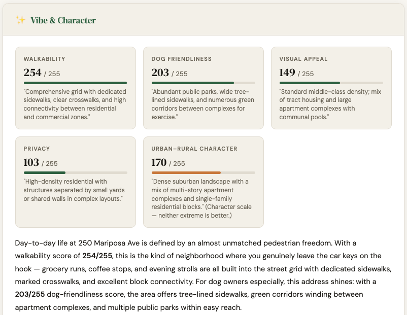

# iHuus Neighborhood Intelligence — AI Extensions

[](LICENSE)
[](https://modelcontextprotocol.io/)
[](https://ihuus.com/pricing)

Ready-to-use [Model Context Protocol (MCP)](https://modelcontextprotocol.io/) extensions
for building AI-powered neighborhood analysis agents. Connect
[Gemini CLI](https://github.com/google-gemini/gemini-cli) or
[Claude Desktop](https://claude.ai/download) to remote MCP servers that provide
walkability scores, school ratings, flood risk, air quality, demographics, and more for
any US address — no backend code required.

**[Documentation](https://docs.ihuus.com/)** · **[Plans & Pricing](https://ihuus.com/pricing)**

<p align="center">
  <a href="https://static.ihuus.com/reports/neighborhood_report_250_mariposa_ave.html">
    
  </a>
  <br>
  <em>Sample neighborhood report generated by Claude Desktop using iHuus tools</em>
</p>

---

## Prerequisites

| Requirement        | Details                                                                                                    |
| ------------------ | ---------------------------------------------------------------------------------------------------------- |
| **iHuus API key**  | `API AI Pro` plan required — [get one at ihuus.com/pricing](https://ihuus.com/pricing)                     |
| **Gemini CLI**     | For extensions under `gemini/` — [install guide](https://github.com/google-gemini/gemini-cli#installation) |
| **Claude Desktop** | For the bundle under `claude/` — [download](https://claude.ai/download)                                    |

---

## Quick Start

**Claude Desktop** — no clone needed:

1. Download [`mcpb.mcpb`](https://github.com/ihuus/mcp/raw/main/claude/desktop/mcpb.mcpb)
   and open it.
2. Paste your iHuus API key when prompted.

**Gemini CLI** — clone and link:

```bash
git clone https://github.com/ihuus/mcp.git
cd mcp

export IHUUS_API_KEY=your_key_here      # https://ihuus.com/pricing
export GEMINI_API_KEY=your_key_here     # https://aistudio.google.com/apikey

gemini extensions link gemini/full
gemini
```

---

## Extension Coverage

| Domain           | Tools                                                                  | Coverage                        |
| ---------------- | ---------------------------------------------------------------------- | ------------------------------- |
| **Demographics** | Insurance coverage · Ideological lean · Age profile                    | National                        |
| **Environment**  | Noise levels · Industrial proximity · Air quality                      | National                        |
| **Risk**         | Flood safety · Fire risk                                               | Flood: national · Fire: CA only |
| **Schools**      | School search · District lookup · School detail                        | CA and TX only                  |
| **Vibe**         | Walkability · Privacy · Visual appeal · Dog friendliness · Urban–rural | National                        |
| **Geospatial**   | Address geocoding (used automatically by all tools)                    | National                        |

- **Gemini CLI** — per-domain extensions or a full all-in-one extension
- **Claude Desktop** — single MCPB bundle with all domains included

> **Data availability:** School data covers **California and Texas**. Fire risk covers
> **California only** (CALFIRE). All other tools have national US coverage.

---

## Repository Structure

```
.
├── .env.example           # Auth template — copy to .env and fill in your keys
├── gemini/                # Gemini CLI extensions
│   ├── demographics/
│   ├── environment/
│   ├── full/              # All domains in one extension
│   ├── risk/
│   ├── schools/
│   └── vibe/
└── claude/                # Claude Desktop MCP bundle
    └── desktop/           # One-click .mcpb installer
        ├── manifest.json
        ├── server/        # Node.js stdio proxy
        └── mcpb.mcpb      # Pre-built bundle — download and open
```

---

## Gemini CLI — Getting Started

See [`gemini/README.md`](gemini/README.md) for detailed setup instructions.

```bash
# Link the full extension (all domains)
gemini extensions link gemini/full

# Start a session — tools are loaded automatically
gemini
```

---

## Claude Desktop — Getting Started

See [`claude/README.md`](claude/README.md) for detailed setup instructions.

1. **Download** [`mcpb.mcpb`](https://github.com/ihuus/mcp/raw/main/claude/desktop/mcpb.mcpb)
   and open it — Claude Desktop shows an install dialog.
2. **Paste your iHuus API key** when prompted.
3. **Verify** the extension is enabled under Settings → extensions list.

---

## Authentication

All extensions authenticate via your **iHuus API key** (`Bearer $IHUUS_API_KEY`).

- **Gemini CLI** — set `IHUUS_API_KEY` as an environment variable in your shell.
- **Claude Desktop** — paste your key during MCPB bundle install. It's stored
  securely on your machine.

[Get your API key →](https://ihuus.com/pricing)

---

## More Resources

- [Full API Documentation](https://docs.ihuus.com/)
- [Plans & Pricing](https://ihuus.com/pricing)
- [iHuus Website](https://ihuus.com/)
- [Model Context Protocol Specification](https://modelcontextprotocol.io/)

---

## Feedback

This repository does not accept external pull requests at this time. For feedback, bug
reports, or feature requests, please email **contact@ihuus.com**.
